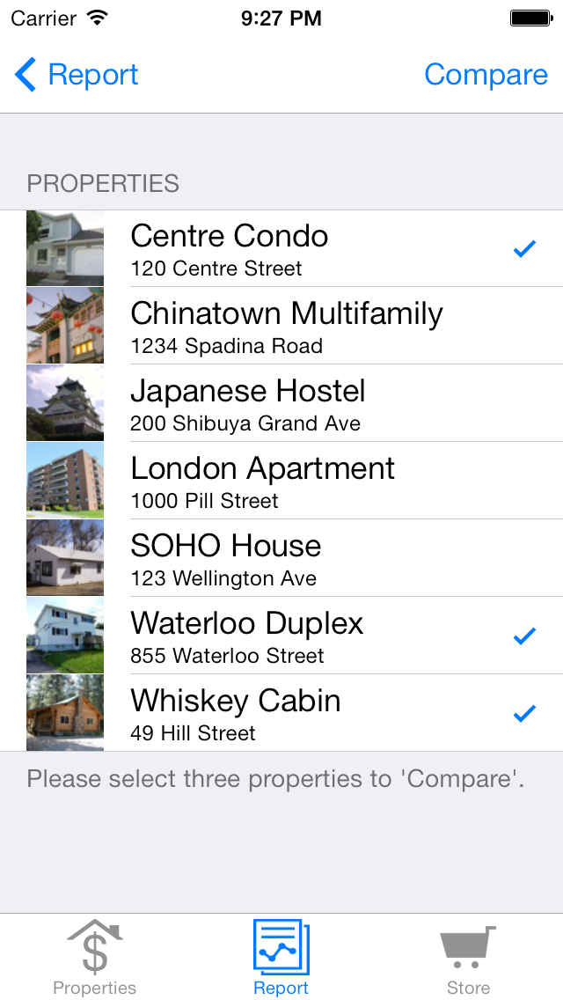

## Lesson 05 - ReactDOM, Hot Module Reloading, List View, ES6 Arrow Function
### (1) Create our app.
  ```
  cd ~/javascript/bcinnovationlabs/
  create-react-app lesson-05
  cd lesson-05
  npm start
  ```

### (2) What is ReactDOM?

* Located in your projects location: ``src/index.js``. Here is the contents.

    ```js
    import React from 'react';
    import ReactDOM from 'react-dom';
    import './index.css';
    import App from './App';
    import * as serviceWorker from './serviceWorker';

    ReactDOM.render(<App />, document.getElementById('root'));
    ```

* You can see the ``ReactDOM`` **class** renders our ``react`` application and outputs the data to the ``root`` element in our HTML code.

* Where is ``root`` element? It is located at ``public/index.html``.

*  Can ``ReactDOM.render()`` be called multiple times across your application? Yes it can.

* The first argument is ``JSX`` that gets rendered.

* The second argument specifies the place where the React application hooks into your HTML.

### (3) What is Hot Module Reloading (HMR)?

* The code looks like this:

    ```js
    import React from 'react';
    import ReactDOM from 'react-dom';
    import App from './App';
    import './index.css';
    ReactDOM.render(
      <App />,
      document.getElementById('root')
    );

    // The next three lines are "hot module loading".
    if (module.hot) {
      module.hot.accept()
    }
    ```

* HMR makes it so you no longer have to refresh the entire page to see the latest code you've changed, but only the components you've programmatically changed.

### (4) What is a List View?

* A list view is defined as "a user interface control that can display a set of icons, possibly with accompanying text captions" according to [Definitions](https://www.definitions.net/definition/listview).

* Example:

    

* We are going to take our knowledge of what we learned and build a list view.

* List views primarily call the ``list api endpoint`` in a web-application.

### (5) List View

1. Our goal is to take artifical data that you would receive from an API endpoint and generate our list view in ``react``. Here is the list data we want to build our ``react`` view on.

    ```js
    const list = [
        {
          title: 'React',
          url: 'https://facebook.github.io/react/',
          author: 'Jordan Walke',
          num_comments: 3,
          points: 4,
          objectID: 0,
        }, {
            title: 'Redux',
            url: 'https://github.com/reactjs/redux',
            author: 'Dan Abramov, Andrew Clark',
            num_comments: 2,
            points: 5,
            objectID: 1,
        },
    ];
    ```

2. Before we start programming, we want to be using a ``ES6`` for-loop to iterate over this data. It will look like something like this:

    ```js
    var list =[];
    list.map(function(item) {
        // Some code here.
    });
    ```

3. Let's begin by opening up our ``src/App.js`` file. Copy and paste the following code and run it. What do you see?

    ```js
    import React, { Component } from 'react';
    import logo from './logo.svg';
    import './App.css';

    const list = [
        {
          title: 'React',
          url: 'https://facebook.github.io/react/',
          author: 'Jordan Walke',
          num_comments: 3,
          points: 4,
          objectID: 0,
        }, {
            title: 'Redux',
            url: 'https://github.com/reactjs/redux',
            author: 'Dan Abramov, Andrew Clark',
            num_comments: 2,
            points: 5,
            objectID: 1,
        },
    ];

    class App extends Component {
      render() {
        return (
          <div className="App">
            { list.map(function(item) {
              return <div>{item.title}</div>;
            })}
          </div>
        );
      }
    }

    export default App;
    ```

4. The ``map`` function generates a single row from our list array. We only output the title but we can output more! Here is how you would add more content to be outputted per row.

    ```js
    import React, { Component } from 'react';
    import logo from './logo.svg';
    import './App.css';

    const list = [
        {
          title: 'React',
          url: 'https://facebook.github.io/react/',
          author: 'Jordan Walke',
          num_comments: 3,
          points: 4,
          objectID: 0,
        }, {
            title: 'Redux',
            url: 'https://github.com/reactjs/redux',
            author: 'Dan Abramov, Andrew Clark',
            num_comments: 2,
            points: 5,
            objectID: 1,
        },
    ];

    class App extends Component {
      render() {
        return (
          <div className="App">
            { list.map(function(item) {
              return (
                <div>
                  <span>
                    <a href={item.url}>{item.title}</a>
                  </span>
                  <span>{item.author}</span>
                  <span>{item.num_comments}</span>
                  <span>{item.points}</span>
                </div>
              );
            })}
          </div>
        );
      }
    }

    export default App;
    ```

5. There is one problem with this code. We need to identify each row so ``React`` can work efficiently.

    ```js
    import React, { Component } from 'react';
    import logo from './logo.svg';
    import './App.css';

    const list = [
        {
          title: 'React',
          url: 'https://facebook.github.io/react/',
          author: 'Jordan Walke',
          num_comments: 3,
          points: 4,
          objectID: 0,
        }, {
            title: 'Redux',
            url: 'https://github.com/reactjs/redux',
            author: 'Dan Abramov, Andrew Clark',
            num_comments: 2,
            points: 5,
            objectID: 1,
        },
    ];

    class App extends Component {
      render() {
        return (
          <div className="App">
            { list.map(function(item) {
              return (
                <div key={item.objectID}>
                  <span>
                    <a href={item.url}>{item.title}</a>
                  </span>
                  <span>{item.author}</span>
                  <span>{item.num_comments}</span>
                  <span>{item.points}</span>
                </div>
              );
            })}
          </div>
        );
      }
    }

    export default App;
    ```

### (5) ES6 Arrow

1. Currently the code looks complex as we are using the primary Javascript code. We can take advantage of ``ES6`` code and simplify it.

    ```js
    // This "function expression" ...
    function () { ... }

    // Is exactly similar to this "arrow function expression".
    () => { ... }
    ```

2. Before we begin, remember these rules.

    ```js
    // allowed
    item => { ... }

    // allowed
    (item) => { ... }

    // not allowed
    item, key => { ... }

    // allowed
    (item, key) => { ... }
    ```

3. Now we are ready. Lets simplify!

    ```js
    { list.map(item => {
        return (
          <div key={item.objectID}>
            <span>
              <a href={item.url}>{item.title}</a>
            </span>
            <span>{item.author}</span>
            <span>{item.num_comments}</span>
            <span>{item.points}</span>
          </div>
        );
    })}
    ```

4. Still complex, lets make it even simpler.

    ```js
    { list.map(item =>
        <div key={item.objectID}>
          <span>
            <a href={item.url}>{item.title}</a>
          </span>
          <span>{item.author}</span>
          <span>{item.num_comments}</span>
          <span>{item.points}</span>
      </div>
    )}
    ```

5. So your code should look like this:

    ```js
    import React, { Component } from 'react';
    import logo from './logo.svg';
    import './App.css';

    const list = [
        {
          title: 'React',
          url: 'https://facebook.github.io/react/',
          author: 'Jordan Walke',
          num_comments: 3,
          points: 4,
          objectID: 0,
        }, {
            title: 'Redux',
            url: 'https://github.com/reactjs/redux',
            author: 'Dan Abramov, Andrew Clark',
            num_comments: 2,
            points: 5,
            objectID: 1,
        },
    ];

    class App extends Component {
      render() {
        return (
          <div className="App">
          { list.map(item =>
              <div key={item.objectID}>
                <span>
                  <a href={item.url}>{item.title}</a>
                </span>
                <span>{item.author}</span>
                <span>{item.num_comments}</span>
                <span>{item.points}</span>
            </div>
          )}
          </div>
        );
      }
    }

    export default App;
    ```

6. And we are done! Moving forward, try to use the ``Arrow`` functions.

### (6) Homework.

1. Assignment. Write a list view for the following data.

    ```js
    const food_list = [
        {
          title: 'Pork Chop',
          wikiUrl: 'https://en.wikipedia.org/wiki/Pork_chop',
          photoUrl: 'https://upload.wikimedia.org/wikipedia/commons/thumb/6/64/Pork_chops_served.jpg/1024px-Pork_chops_served.jpg',
          description: 'A pork chop, like other meat chops, is a loin cut taken perpendicularly to the spine of the pig and usually containing a rib or part of a vertebra. Pork chops are not processed and are leaner than other cuts of pork. Chops are commonly served as an individual portion.',
          objectID: 0,
          ingredients: ['Meat', 'flour', 'lemon'],
          comments_count: 5,
        }, {
            title: 'Chow mein',
            wikiUrl: 'https://en.wikipedia.org/wiki/Chow_mein',
            photoUrl: 'https://upload.wikimedia.org/wikipedia/commons/d/d1/Chow_mein_1_by_yuen.jpg',
            description: 'The words chow mein mean "stir-fried noodle", chow meaning "stir-fried" (or "sautéed") and mein meaning "noodles".',
            objectID: 1,
            ingredients: ['Noodles', 'soy sauce', 'vegetables']
            comments_count: 54,
        },
    ];
    ```

2. Prepare for next tutorial.
   * "The Road to React" pages 28 to x
   * https://reactjs.org/docs/state-and-lifecycle.html
