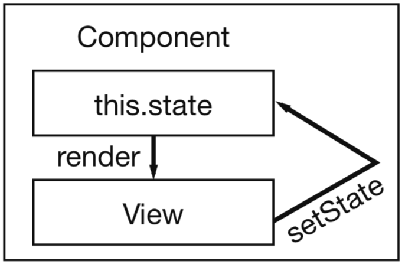

## Lesson 06 - State
### (1) Create our app.
  ```
  cd ~/javascript/bcinnovationlabs/
  create-react-app lesson-06
  cd lesson-06
  npm start
  ```

### (2) What is state?

* State is similar to props, but it is private and fully controlled by the component.

* Each time when the state or the props of a component change, the ``render()`` method is called.

### (3) State Example

1. Take a look at this code. We learned this is two components running to generate the date-time for our computer. We want to update the *Clock* component to have a state. How would we do that?

    ```js
    import React, { Component } from 'react';
    import logo from './logo.svg';
    import './App.css';

    class Clock extends React.Component {
      render() {
        return (
          <div className="Clock">
            <h2>Hello, world!</h2>
            <h3>It is {this.props.date}.</h3>
          </div>
        );
      }
    }


    class App extends Component {
      render() {
        var new_date = Date();
        return (
          <div className="App">
              <h1>Begin...</h1>
              <Clock date={new_date} />
          </div>
        );
      }
    }

    export default App;
    ```

2. We replace ``this.props.date`` with ``this.state.date`` in the ``render()`` method.

3. Add a class constructor that assigns the initial this.state.

4. Here is how the code would look like with our changes:

    ```js
    import React, { Component } from 'react';
    import logo from './logo.svg';
    import './App.css';

    class Clock extends React.Component {
      // STEP 1: Create our constructor.
      constructor(props) {
        // STEP 2: We pass props to the base constructor:
        super(props);

        // STEP 3: Assigns the initial
        this.state = {date: new Date()};
      }

      // STEP 4: Our render function.
      render() {
        return (
          <div>
            <h1>Hello, world!</h1>
            <h2>It is {this.state.date.toLocaleTimeString()}.</h2>
          </div>
        );
      }
    }

    class App extends Component {
      render() {
        // STEP 5: We no longer need to pass in our 'props'.
        return (
          <div className="App">
              <h1>Begin...</h1>
              <Clock />
          </div>
        );
      }
    }

    export default App;
    ```

5. Now we want our compontent to update the date-time. We will call the ``componentDidMount();`` function which will run our code **after the component was rendered**.

    ```js
    componentDidMount() {
        this.timerID = setInterval(
          () => this.tick(),
          1000
        );
    }
    ```

6. We need the following code to handle when the component will be removed.

    ```js
    componentWillUnmount() {
        clearInterval(this.timerID);
     }
    ```

7. Finally, we will implement a method called ``tick()``. This function run every second. It will use this.setState() to schedule updates to the component local state:

    ```js
    import React, { Component } from 'react';
    import logo from './logo.svg';
    import './App.css';

    class Clock extends React.Component {
      // STEP 1: Our components constructor must pass on the `props` to the parent
      //         class and our component NEEDS TO HAVE THE STATE INITIALIZED here
      //         before we use it anywhere else in our component.
      constructor(props) {
        super(props);
        this.state = {date: new Date()};
      }

      // STEP 2: When this component FINISHED LOADING ON SCREEN then this
      //         function will be called. This function will be called only
      //         once in the entire application.
      componentDidMount() {
        // STEP 3: We will load up a javascript timer on this method. This timer
        //         will run every second (see "1000") and will call our components
        //         "tick" function (see "tick()" below).
        this.timerID = setInterval(
          () => this.tick(),
          1000
        );
      }

      // STEP 4: This function will be called once and only when this component
      //         is closing.
      componentWillUnmount() {
        clearInterval(this.timerID);
      }

      // STEP 5: This function is where we will set our new date and time.
      //         Please note it is not React library function, this is a custom
      //         function we created.
      tick() {
        // STEP 6: Change the 'state' of the component. This is how you change state.
        this.setState({
          date: new Date()
        });
      }

      render() {
        return (
          <div>
            <h1>Hello, world!</h1>
            <h2>It is {this.state.date.toLocaleTimeString()}.</h2>
          </div>
        );
      }
    }

    class App extends Component {
      render() {
        // STEP 7: This is how to call our component from our main application component.
        return (
          <div className="App">
              <h1>Begin...</h1>
              <Clock />
          </div>
        );
      }
    }

    export default App;
    ```

### (4) State Example 2

1. Let us update our list view example to use states. Here is how last lessons looked like for our file ``src/App.js``:

    ```js
    import React, { Component } from 'react';
    import logo from './logo.svg';
    import './App.css';

    const list = [
        {
          title: 'React',
          url: 'https://facebook.github.io/react/',
          author: 'Jordan Walke',
          num_comments: 3,
          points: 4,
          objectID: 0,
        }, {
            title: 'Redux',
            url: 'https://github.com/reactjs/redux',
            author: 'Dan Abramov, Andrew Clark',
            num_comments: 2,
            points: 5,
            objectID: 1,
        },
    ];

    class App extends Component {
      render() {
        return (
          <div className="App">
          { list.map(item =>
              <div key={item.objectID}>
                <span>
                  <a href={item.url}>{item.title}</a>
                </span>
                <span>{item.author}</span>
                <span>{item.num_comments}</span>
                <span>{item.points}</span>
            </div>
          )}
          </div>
        );
      }
    }

    export default App;
    ```

2. How do we begin updating? Hint, see what are the steps in our previous example.

    * STEP 1: Create our ``constructor()``. Make sure our state is assigned there.

    * STEP 2: Create our ``componentDidMount()`` function and fill it with code to load AFTER THE VIEW HAS BEEN RENDERED.

    * STEP 4: Create our ``componentWillUnmount()`` function to handle when our component will be closed.

    * STEP 7: Update our ``render()`` function.

3. Therefore the code would look like this:

    ```js
    import React, { Component } from 'react';
    import logo from './logo.svg';
    import './App.css';

    // STEP 1: This is the data we will be inputting into our component. Study it.
    const list = [
        {
          title: 'React',
          url: 'https://facebook.github.io/react/',
          author: 'Jordan Walke',
          num_comments: 3,
          points: 4,
          objectID: 0,
        }, {
            title: 'Redux',
            url: 'https://github.com/reactjs/redux',
            author: 'Dan Abramov, Andrew Clark',
            num_comments: 2,
            points: 5,
            objectID: 1,
        },
    ];

    // STEP 2: Create our component.
    class ListView extends React.Component {

        // STEP 3: Create our ``constructor()``.
        constructor(props) {
          super(props); // Don't forget this line of code - it's mandatory!

          // STEP 4: Pass in our ``list`` variable into our state.
          //         Please note, state always needs to be a
          //         dictionary type.
          this.state = {
              list: list,
          };
        }

        // STEP 5: Put in this function for React best practice.
        //         But don't bother entering anything in there.
        componentDidMount() {
            // Do nothing.
        }

        // STEP 6: Put in this function for React best practice.
        //         But don't bother entering anything in there.
        componentWillUnmount() {
            // Do nothing.
        }

        // STEP 7: Create our render.
        render() {
          return (
            <div className="ListView">
            { this.state.list.map(item =>
                <div key={item.objectID}>
                    <span>
                      <a href={item.url}>{item.title}</a>
                    </span>
                    <span>{item.author}</span>
                    <span>{item.num_comments}</span>
                    <span>{item.points}</span>

                 </div>
            )}
            </div>
          );
        }

    }


    class App extends Component {
      render() {
        return (
          // STEP 8: Update our render to support our list view.
          <div className="App">
              <h1>Learn React</h1>
              <ListView />
          </div>
        );
      }
    }

    export default App;
    ```

### (5) State Interaction

* Currently our code does nothing special. We want a button to close any of the list items.

1. Take our code from before and lets dd the ability to close any row item.

    ```js
    import React, { Component } from 'react';
    import logo from './logo.svg';
    import './App.css';

    const list = [
        {
          title: 'React',
          url: 'https://facebook.github.io/react/',
          author: 'Jordan Walke',
          num_comments: 3,
          points: 4,
          objectID: 0,
        }, {
            title: 'Redux',
            url: 'https://github.com/reactjs/redux',
            author: 'Dan Abramov, Andrew Clark',
            num_comments: 2,
            points: 5,
            objectID: 1,
        },
    ];

    class ListView extends React.Component {

        constructor(props) {
          super(props);

          this.state = {
              list: list,
          };

          // STEP 2: You have to bind class methods in the constructor. Here we
          //         are binding the "onDismiss" function to our component.
          this.onDismiss = this.onDismiss.bind(this);
        }

        componentDidMount() {
            // Do nothing.
        }

        componentWillUnmount() {
            // Do nothing.
        }

        // STEP 3: Here we define our function which will be called when the user
        //         closes a row.
        onDismiss(id) {
            // Do something!
            console.log("Closing row", id);
        }

        render() {
          // STEP 1: Add our button here. Notice that we are using ES6 to
          //         call a function which will call our JSX code. This
          //         code will call inside our component the "onDismiss"
          //         function and pass in the list item "objectID" value.
          return (
            <div className="ListView">
            { this.state.list.map(item =>
                <div key={item.objectID}>
                    <span>
                      <a href={item.url}>{item.title}</a>
                    </span>
                    <span>{item.author}</span>
                    <span>{item.num_comments}</span>
                    <span>{item.points}</span>
                    <span>
                  <button
                    onClick={() => this.onDismiss(item.objectID)}
                    type="button"> Dismiss
                  </button>
                </span>
                 </div>
            )}
            </div>
          );
        }

    }


    class App extends Component {
      render() {
        return (
          <div className="App">
              <h1>Learn React</h1>
              <ListView />
          </div>
        );
      }
    }

    export default App;
    ```

2. If you run this code and click, you should see values being outputed in your developers console. Now how do we close the row?

3. We know that our list is a javascript array. We know javascript supports [filtering](https://developer.mozilla.org/en-US/docs/Web/JavaScript/Reference/Global_Objects/Array/filter) of our data so let us take advantage of that. Therefore our ``onDismiss`` function would look like this:

    ```js
    onDismiss(id) {
        // STEP 1: Lets create a function which will take our list item and
        //         return TRUE or FALSE depending on whether the ID matches.
        function isNotId(item) {
            return item.objectID !== id;
        }

        // STEP 2: Use the javascript `filter` function. If you do not understand
        //         what is going on then read about this filter function on google.
        const updatedList = this.state.list.filter(isNotId);

        // STEP 3: Finally update our state with our new list. The component
        //         will automatically update based on the state change.
        this.setState({ list: updatedList });
    }
    ```

4. Please note you can write your code like this too.

    ```js
    onDismiss(id) {
        // STEP 1: Re-write to take advantage of ES6.
        const isNotId = item => item.objectID !== id;

        const updatedList = this.state.list.filter(isNotId);

        this.setState({ list: updatedList });
    }
    ```

5. Update your code with that dismiss function and you will see the code working. Here is how your code is supposed to look like.

    ```js
    import React, { Component } from 'react';
    import logo from './logo.svg';
    import './App.css';

    const list = [
        {
          title: 'React',
          url: 'https://facebook.github.io/react/',
          author: 'Jordan Walke',
          num_comments: 3,
          points: 4,
          objectID: 0,
        }, {
            title: 'Redux',
            url: 'https://github.com/reactjs/redux',
            author: 'Dan Abramov, Andrew Clark',
            num_comments: 2,
            points: 5,
            objectID: 1,
        },
    ];

    class ListView extends React.Component {

        constructor(props) {
          super(props);

          this.state = {
              list: list,
          };

          this.onDismiss = this.onDismiss.bind(this);
        }

        componentDidMount() {
            // Do nothing.
        }

        componentWillUnmount() {
            // Do nothing.
        }

        onDismiss(id) {
            const isNotId = item => item.objectID !== id;
            const updatedList = this.state.list.filter(isNotId);
            this.setState({ list: updatedList });
        }

        render() {
          return (
            <div className="ListView">
            { this.state.list.map(item =>
                <div key={item.objectID}>
                    <span>
                      <a href={item.url}>{item.title}</a>
                    </span>
                    <span>{item.author}</span>
                    <span>{item.num_comments}</span>
                    <span>{item.points}</span>
                    <span>
                  <button
                    onClick={() => this.onDismiss(item.objectID)}
                    type="button"> Dismiss
                  </button>
                </span>
                 </div>
            )}
            </div>
          );
        }

    }


    class App extends Component {
      render() {
        return (
          <div className="App">
              <h1>Learn React</h1>
              <ListView />
          </div>
        );
      }
    }

    export default App;
    ```

### (5) State Interaction Theory

The key idea is as follows:

1. The view is the post-rendered GUI which gets displayed to the user.

2. On the view, there is button that is attached to the "onDismiss" function.

3. Once the button is clicked, the "onDismiss" function gets called.

4. Inside the "onDismiss" function, we update our list of items to no longer have one of the rows.

5. Then we call the "setState" function to update our list. Once this function is called, ``react`` knows we need to re-render our output.

6. React re-renders and our new graphics are displayed.

Conceptually, here is a diagram explaining it.




### (6) Homework

1. Assignment. Add close buttons per row (as you learned in this lesson) to the last lessons assignment.

2. Prepare for next tutorial.
   * "The Road to React" pages 37 to 46
   * https://reactjs.org/docs/handling-events.html
   * https://en.wikipedia.org/wiki/Higher-order_function
   * https://reactjs.org/docs/forms.html
